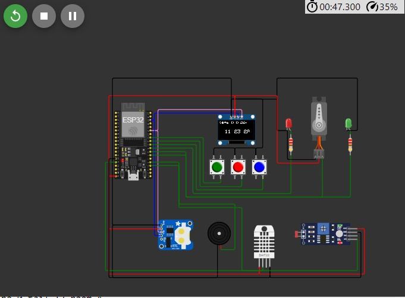
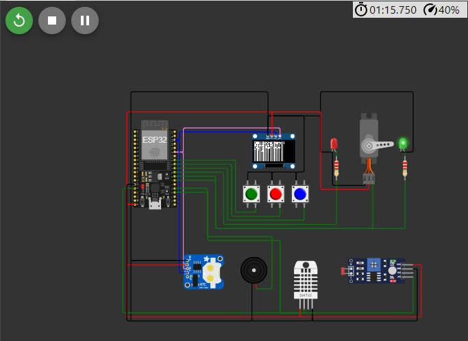
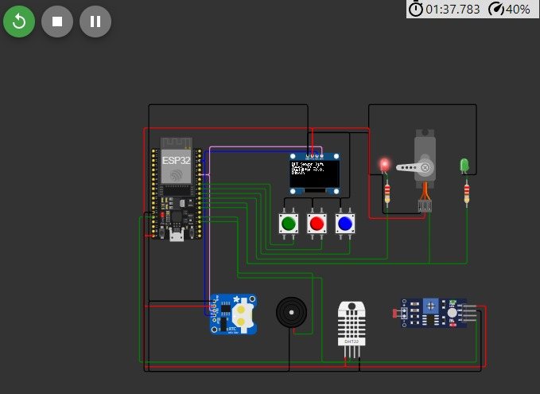
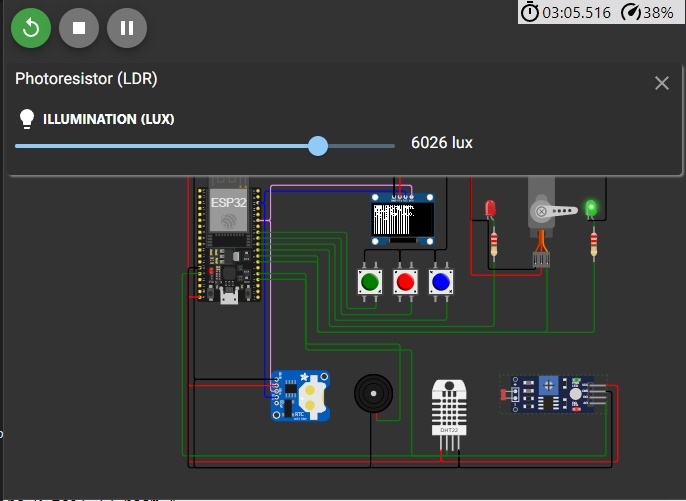
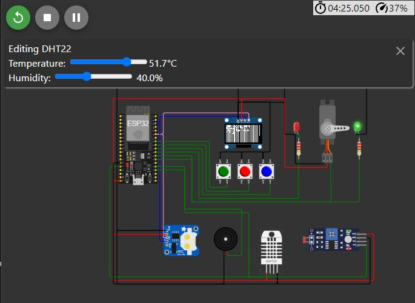

# Final Project Virose

Disini saya akan medokumentasikan final proyek virose

## FITUR

1. **Tampilan Waktu**: Menampilkan waktu saat ini dari RTC (lihat fungsi `displayTime()`).

2. **Monitoring Suhu dan Kelembaban**: Menggunakan sensor DHT untuk menampilkan suhu, kelembaban, dan status suhu. Juga mengontrol servo dan LED berdasarkan suhu (lihat fungsi `displayDHTData()`).

3. **Monitoring Intensitas Cahaya**: Menggunakan sensor LDR untuk menampilkan intensitas cahaya dan status. Mengontrol servo dan LED berdasarkan intensitas cahaya (lihat fungsi `displayLDRData()`).

4. **Sistem Alarm**: Memungkinkan pengguna untuk mengatur alarm dan membunyikan alarm saat waktunya tiba (lihat fungsi `setAlarm()` dan `checkAlarm()`).

5. **Kontrol Multi-mode**: Menggunakan tombol untuk beralih antara berbagai mode (lihat fungsi `checkButtons()`).

6. **Auto-return**: Kembali ke tampilan waktu default setelah 30 detik tidak ada input.

7. **Animasi OLED**: Menampilkan animasi grafik batang untuk visualisasi data (lihat bagian animasi dalam `displayDHTData()`).

8. **Kontrol Servo**: Menggerakkan servo berdasarkan input sensor (lihat bagian kontrol servo dalam `displayDHTData()` dan `displayLDRData()`).

9. **Indikator LED**: Menggunakan LED merah dan hijau untuk indikasi visual berdasarkan data sensor.

10. **Alarm Audio**: Membunyikan melodi alarm menggunakan buzzer (lihat fungsi `playAlarmMelody()`).

### Tampilan Waktu (Default Mode)


Menampilkan waktu saat ini dari RTC
Kode: Fungsi displayTime()

```c++
void displayTime() {
  DateTime now = rtc.now();
  
  oled.clearDisplay();
  oled.setTextSize(1);
  oled.setCursor(0, 0);
  oled.print(daysOfWeek[now.dayOfTheWeek()]);
  oled.print(", ");
  oled.print(now.day());
  oled.print('/');
  oled.print(now.month());
  oled.print('/');
  oled.println(now.year());
  
  oled.setTextSize(2);
  oled.setCursor(20, 30);
  oled.print(now.hour());
  oled.print(':');
  oled.print(now.minute());
  oled.print(':');
  oled.print(now.second());
  
  oled.display();
}

void displayDHTData() {
  TempAndHumidity data = dhtSensor.getTempAndHumidity();
  
  oled.clearDisplay();
  oled.setTextSize(1);
  oled.setCursor(0, 0);
  oled.println("DHT Sensor Data");
  oled.print("Temp: ");
  oled.print(data.temperature, 1);
  oled.println(" C");
  oled.print("Humidity: ");
  oled.print(data.humidity, 1);
  oled.println("%");
  
  String status;
  if (data.temperature < 20) status = "Dingin";
  else if (data.temperature < 25) status = "Netral";
  else if (data.temperature < 30) status = "Hangat";
  else status = "Panas";
  
  oled.println(status);
  oled.display();

  // Control servo and LEDs based on temperature
  int servoAngle = map(data.temperature, 0, 50, 0, 180);
  servo.write(servoAngle);

  if (data.temperature < 25) {
    digitalWrite(RED_LED_PIN, HIGH);
    digitalWrite(GREEN_LED_PIN, LOW);
  } else {
    digitalWrite(RED_LED_PIN, LOW);
    digitalWrite(GREEN_LED_PIN, HIGH);
  }

  for (int i = 0; i < SCREEN_WIDTH; i += 4) {
    oled.drawLine(i, SCREEN_HEIGHT - 1, i, SCREEN_HEIGHT - 1 - (data.temperature / 50.0 * SCREEN_HEIGHT), WHITE);
    oled.display();
    delay(10);
  }
}

### Sensor DHT (Mode 1)

Menampilkan suhu dan kelembaban
Menampilkan status suhu (dingin, netral, hangat, panas)
Mengontrol servo dan LED berdasarkan suhu
Kode: Fungsi displayDHTData()

```c++
void displayDHTData() {
  TempAndHumidity data = dhtSensor.getTempAndHumidity();
  
  oled.clearDisplay();
  oled.setTextSize(1);
  oled.setCursor(0, 0);
  oled.println("DHT Sensor Data");
  oled.print("Temp: ");
  oled.print(data.temperature, 1);
  oled.println(" C");
  oled.print("Humidity: ");
  oled.print(data.humidity, 1);
  oled.println("%");
  
  String status;
  if (data.temperature < 20) status = "Dingin";
  else if (data.temperature < 25) status = "Netral";
  else if (data.temperature < 30) status = "Hangat";
  else status = "Panas";
  
  oled.println(status);
  oled.display();

  // Control servo and LEDs based on temperature
  int servoAngle = map(data.temperature, 0, 50, 0, 180);
  servo.write(servoAngle);

  if (data.temperature < 25) {
    digitalWrite(RED_LED_PIN, HIGH);
    digitalWrite(GREEN_LED_PIN, LOW);
  } else {
    digitalWrite(RED_LED_PIN, LOW);
    digitalWrite(GREEN_LED_PIN, HIGH);
  }

  for (int i = 0; i < SCREEN_WIDTH; i += 4) {
    oled.drawLine(i, SCREEN_HEIGHT - 1, i, SCREEN_HEIGHT - 1 - (data.temperature / 50.0 * SCREEN_HEIGHT), WHITE);
    oled.display();
    delay(10);
  }
}

### Sensor LDR (Mode 2)

Menampilkan intensitas cahaya (lux)
Menampilkan status cahaya (gelap atau terang)
Mengontrol servo dan LED berdasarkan intensitas cahaya
Kode: Fungsi displayLDRData()

```c++
void displayLDRData() {
  int analogValue = analogRead(LDR_PIN);
  float voltage = analogValue / 1024. * 5;
  float resistance = 2000 * voltage / (1 - voltage / 5);
  float lux = pow(RL10 * 1e3 * pow(10, GAMMA) / resistance, (1 / GAMMA));
  
  oled.clearDisplay();
  oled.setTextSize(1);
  oled.setCursor(0, 0);
  oled.println("LDR Sensor Data");
  oled.print("Light: ");
  oled.print(lux, 2);
  oled.println(" lux");
  
  String status = (lux < 50) ? "Gelap" : "Terang";
  oled.println(status);
  oled.display();

  // Control servo and LEDs based on light intensity
  int servoAngle = map(lux, 0, 1000, 0, 180);
  servo.write(servoAngle);

  if (lux < 50) {
    digitalWrite(RED_LED_PIN, HIGH);
    digitalWrite(GREEN_LED_PIN, LOW);
  } else {
    digitalWrite(RED_LED_PIN, LOW);
    digitalWrite(GREEN_LED_PIN, HIGH);
  }

  float middleLux = 500; // Sesuaikan dengan kebutuhan
  if (lux < middleLux) {
    digitalWrite(RED_LED_PIN, HIGH);
    digitalWrite(GREEN_LED_PIN, LOW);
  } else {
    digitalWrite(RED_LED_PIN, LOW);
    digitalWrite(GREEN_LED_PIN, HIGH);
  }
}

### Setting Alarm (Mode 3)

Mengatur waktu alarm menggunakan tombol
Kode: Fungsi setAlarm()

```c++
void setAlarm() {
  DateTime now = rtc.now();
  
  oled.clearDisplay();
  oled.setTextSize(1);
  oled.setCursor(0, 0);
  oled.println("Set Alarm");
  oled.print("Current: ");
  oled.print(now.hour());
  oled.print(':');
  oled.println(now.minute());
  
  int alarmHour = (alarmTime / 3600) % 24;
  int alarmMinute = (alarmTime / 60) % 60;
  
  oled.print("Alarm: ");
  oled.print(alarmHour);
  oled.print(':');
  oled.println(alarmMinute);
  
  oled.println(menuOption == 0 ? "> Hour" : "  Hour");
  oled.println(menuOption == 1 ? "> Minute" : "  Minute");
  oled.println(menuOption == 2 ? "> Save" : "  Save");
  
  oled.display();

  if (digitalRead(BUTTON_2_PIN) == LOW) {
    if (menuOption == 0) alarmHour = (alarmHour + 1) % 24;
    if (menuOption == 1) alarmMinute = (alarmMinute + 1) % 60;
    if (menuOption == 2) alarmTime = alarmHour * 3600 + alarmMinute * 60;
  }

  if (menuOption == 2 && digitalRead(BUTTON_2_PIN) == LOW) {
    alarmTime = alarmHour * 3600 + alarmMinute * 60;
    oled.clearDisplay();
    oled.setTextSize(1);
    oled.setCursor(0, 20);
    oled.println("Alarm Saved!");
    oled.display();
    delay(2000);
  }
}

### Alarm

Membunyikan alarm saat waktunya tiba
Menampilkan pesan "Alarm!" di OLED
Kode: Fungsi checkAlarm() dan playAlarmMelody()

```c++
void checkAlarm() {
  DateTime now = rtc.now();
  unsigned long currentTime = now.hour() * 3600 + now.minute() * 60 + now.second();
  if (currentTime == alarmTime) {
    oled.clearDisplay();
    oled.setTextSize(2);
    oled.setCursor(20, 20);
    oled.println("Alarm!");
    oled.display();
    playAlarmMelody();
    delay(5000); // Display for 5 seconds
  }
}

void playAlarmMelody() {
  int melody[] = {262, 330, 392, 523};
  int noteDurations[] = {4, 4, 4, 4};

  for (int i = 0; i < 4; i++) {
    int noteDuration = 1000 / noteDurations[i];
    tone(BUZZER_PIN, melody[i], noteDuration);
    int pauseBetweenNotes = noteDuration * 1.30;
    delay(pauseBetweenNotes);
    noTone(BUZZER_PIN);
  }

### Animasi OLED

Animasi grafik batang untuk data DHT
Kode: Di dalam fungsi displayDHTData(), bagian loop for (int i = 0; i < SCREEN_WIDTH; i += 4)

### Kontrol Servo

Menggerakkan servo berdasarkan suhu atau intensitas cahaya
Kode: Di dalam fungsi displayDHTData() dan displayLDRData()

### Kontrol LED

Menyalakan LED merah atau hijau berdasarkan suhu atau intensitas cahaya
Kode: Di dalam fungsi displayDHTData() dan displayLDRData()

## Tombol Hijau, Biru, Merah

Proyek ini menggunakan tiga tombol untuk kontrol:

1. **Tombol Merah**: Digunakan untuk mengubah mode operasi (Waktu -> DHT -> LDR -> Alarm)
2. **Tombol Biru**: Digunakan untuk mengurangi nilai atau memilih opsi sebelumnya dalam menu
3. **Tombol Hijau**: Digunakan untuk menambah nilai atau memilih opsi berikutnya dalam menu.


### Penjelasan Sensor: Lux dan Temperatur

- Menampilkan tingkat pencahayaan lingkungan
- Menentukan status pencahayaan (gelap atau terang)
- Mengontrol posisi servo berdasarkan intensitas cahaya
- Mengaktifkan LED indikator sesuai dengan tingkat pencahayaan
- Temperatur diukur dengan sensor DHT dan ditampilkan dalam derajat Celsius. nilai suhu ini, perangkat akan memberikan status: dingin, netral, hangat, atau panas.

### gambar





